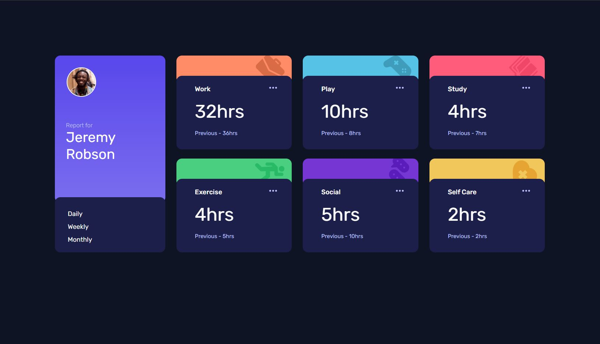

# Frontend Mentor - Time tracking dashboard

This is a solution to the [Time tracking dashboard](https://www.frontendmentor.io/challenges/time-tracking-dashboard-UIQ7167Jw).

## Table of contents

- [Overview](#overview)
  - [Screenshot](#screenshot)
  - [Links](#links)
- [My process](#my-process)
  - [Built with](#built-with)  
  - [Continued development](#continued-development)
- [Author](#author)

## Overview

### Screenshot

- Original design

- My solution

### Links

- [Solution Live URL](https://inanbruneli.github.io/time-tracking-dashboard-main/)

## My process

### Built with

- HTML5
- CSS3
- Mobile First
- Javascript
- Axios
- JSON data

### Continued development

I am current working in improve my CSS skills, so I would be happy to hear what I could do different/better than this.
So, feel free to put your feedback 🚀🚀

## Author

- Frontend Mentor - [@inanbruneli](https://www.frontendmentor.io/profile/inanbruneli)
- Instagram - [@inanbrunelli](https://www.instagram.com/inanbrunelli)
- Github - [@inanbrunelli](https://github.com/inanbruneli)
- Website - [inanbrunell.com](https://inanbrunelli.000webhostapp.com/)